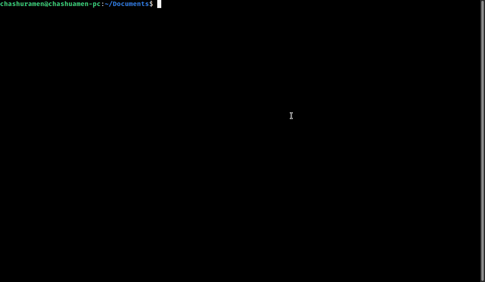

# mangadesk - Terminal client for MangaDex 📖

<p align="center">Download manga directly from your terminal to read!</p>



<p align="center">This client retrieves information straight from MangaDex v5's API. <br>As the API is still a WIP, some changes (probably breaking) might be expected.</p>

## Features ✨

- Download chapters straight to your computer.
- Login to keep track of your followed manga.
- Keep track of already downloaded manga.
- Download multiple chapters together.
- Searching!
- Responsive UI (kind of)
- Written in Golang :)

Works for Windows/Linux/macOS.

## Usage ✍

Simply choose the chapters you want to read to download.

### Download folder

By default, all downloads are stored in a folder titled `downloads`, relative to where you run the application.

However, you can change this by changing the `downloadDir` field in the `usr/usr_config.json` file (this file only
appears after running the application at least once!).

### Languages

By default, English (`en`) is the main language.

You may change your desired language(s) through the `languages` field in the `usr_cofig.json` file.

Please use comma-separated [ISO language codes](https://www.andiamo.co.uk/resources/iso-language-codes/)!


### Keybindings ⌨

- Ctrl + L   : Login/Logout
- Ctrl + K   : Keybindings/Help
- Ctrl + S   : Search
- Ctrl + F/B : Next/Prev Page


- Ctrl + E   : Select multiple chapters
- Ctrl + A   : Toggle select all


- Esc        : Going back

## Installation 🔧

Check out the releases page for relevant files.

For bleeding edge 🗡 updates, you may compile from source:

```
git clone https://github.com/darylhjd/mangadesk.git
cd mangadesk
go get -d ./...
go build
```

## Issues ☠

Check out the Issues page for current issues/feature requests.

## Contributing 🤝

Always welcome and appreciated :)

Please take some time to familiarise yourself with the [contributing guidelines](.github/CONTRIBUTING.md).

## Learning points 🧠

- Creating TUIs with tview/tcell.
- Working with the filesystem in Golang.
- Goroutines.
- Go Project structure.
